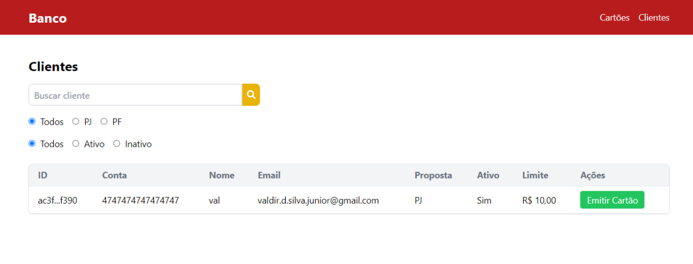

## Projeto de Microserviços - Emissor de Cartões e Gerenciamento de Clientes


Este projeto consiste em dois microserviços desenvolvidos com Spring Boot para emissão de cartões e gerenciamento de clientes, além de uma aplicação front-end em React para interagir com esses serviços.

### Pré-requisitos

- Java 17
- Maven
- Yarn
- PostgreSQL
- RabbitMQ

### Configuração do Banco de Dados

1. Crie dois bancos de dados no PostgreSQL:
   - `emissor-ms`
   - `cartoes-ms`

2. Atualize as configurações de conexão no arquivo `application.properties` de cada microserviço conforme necessário.

### Configuração do RabbitMQ

Para facilitar os testes, este projeto está temporariamente configurado com meus acessos no CloudAMQP. Por favor, substitua essas configurações pelos seus próprios dados de acesso quando necessário.

### Microserviço de Emissão de Cartões (emissor-ms)

#### Executando o Emissor de Cartões

1. Navegue até o diretório do projeto `emissor-ms`.
2. Execute o comando:
   ```bash
   mvn spring-boot:run
   ```

### Microserviço de Gerenciamento de Clientes (cartoes-ms)

#### Executando o Gerenciamento de Clientes

1. Navegue até o diretório do projeto `cartoes-ms`.
2. Execute o comando:
   ```bash
   mvn spring-boot:run
   ```

### Aplicação Front-end (React)

#### Configuração do React

1. Navegue até o diretório do projeto `frontend`.
2. Instale as dependências do projeto:
   ```bash
   yarn install
   ```

#### Executando a Aplicação React

1. Navegue até o diretório do projeto `frontend`.
2. Execute o comando:
   ```bash
   yarn start
   ```

### Acessando os Serviços

- O microserviço de emissão de cartões estará disponível em: `http://localhost:8080`
- O microserviço de gerenciamento de clientes estará disponível em: `http://localhost:8081`
- A aplicação front-end estará disponível em: `http://localhost:3000`

### Observações

- Certifique-se de que o RabbitMQ e o PostgreSQL estão configurados e em execução.
- Atualize as configurações de `spring.mail.username` e `spring.mail.password` com as credenciais do seu servidor de email.
- Verifique se as portas `8080`, `8081` e `3000` estão disponíveis no seu ambiente.

Isso deve cobrir a configuração básica e execução do projeto. Certifique-se de ajustar qualquer configuração adicional conforme necessário para o seu ambiente de desenvolvimento.